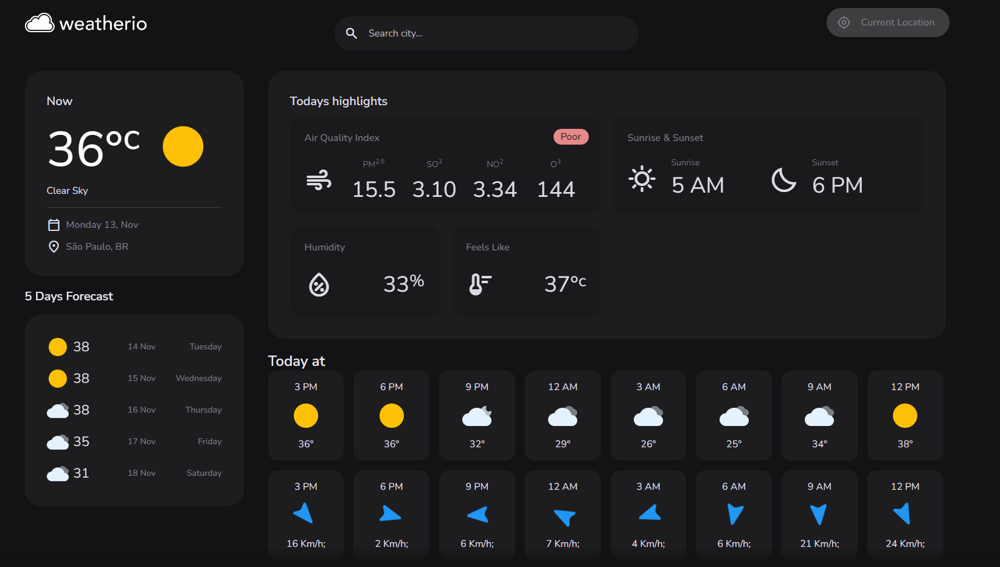

# Weather.IO

Dashboard for weather, where you can see temperature, humidity, wind and other information

## Tech Stack

**Client:** HTML, CSS, JavaScript, API


## Key

To work, you need to put your key in the api.js file

just log on to the openWeather website and redeem your key
- [openWeather-API](https://openweathermap.org/api)

## Link

- [Deploy-Site](https://eweatherio.netlify.app/#/current-location)

## Run Locally

Clone the project

```bash
  git clone https://link-to-project
```

Go to the project directory

```bash
  cd my-project
```

Open with VSCode

```bash
  code .
```

Open with live server


## ScreenShot



## Authors

- [@enzoshiotuqui](https://github.com/EnzoShiotuqui)
